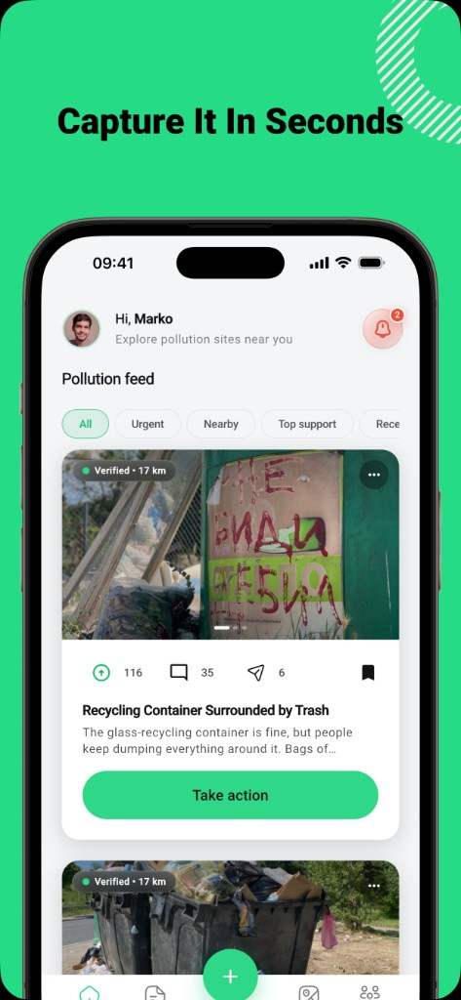
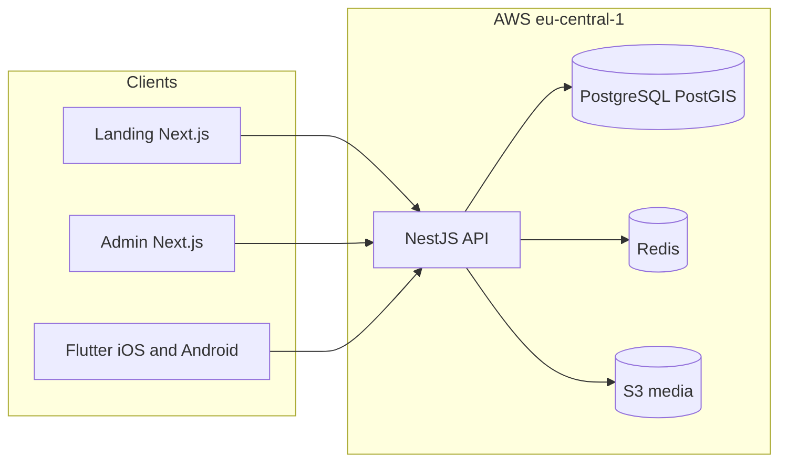

<p align="center">
  
</p>

<h1 align="center">Chisto.mk</h1>

<p align="center">
  <strong>Snap it. Report it. Clean it.</strong><br />
  Civic environmental platform for pollution reporting, cleanup events, and public impact data in Macedonia.
</p>

<p align="center">
  <a href="https://github.com/ivanmitkovski/chisto-mk/actions/workflows/ci.yml?query=branch%3Amain"></a>
  <a href="https://github.com/ivanmitkovski/chisto-mk/actions/workflows/ci.yml?query=branch%3Adevelop"></a>
  
  
</p>

## Live product

| Surface | URL |
|---------|-----|
| Marketing | [chisto.mk](https://chisto.mk) |
| API | [api.chisto.mk](https://api.chisto.mk) |
| Admin | [admin.chisto.mk](https://admin.chisto.mk) |
| iOS (MK App Store) | [chisto-mk](https://apps.apple.com/mk/app/chisto-mk/id6771892086) |
| Android (Google Play) | [Chisto.mk](https://play.google.com/store/apps/details?id=mk.chisto.app) |
| Facebook | [facebook.com](https://www.facebook.com/profile.php?id=61590541866009) |
| Instagram | [@chisto.mk](https://www.instagram.com/chisto.mk/) |
| LinkedIn | [Chisto.mk](https://www.linkedin.com/company/chisto-mk/) |

## Product

<p align="center">
  
</p>

## Architecture



## Stack

| Layer | Technology |
|-------|------------|
| API | NestJS, TypeScript, Prisma, PostgreSQL + PostGIS |
| Admin | Next.js 15 |
| Landing | Next.js 15, next-intl (mk / en / sq) |
| Mobile | Flutter 3.44, Melos workspace |
| Infra | Terraform, ECS, RDS, ElastiCache. See [infra/README.md](infra/README.md) |

## Quick start

### Prerequisites

- Node.js 20.19+
- pnpm 10+ (`corepack enable`)
- Docker (local Postgres)
- Flutter 3.44+ (mobile only)

### Setup

```bash
pnpm install
docker compose up -d postgres
cp .env.local.example .env
pnpm db:push
pnpm dev
```

| Service | Local URL |
|---------|-----------|
| API | http://localhost:3000 |
| OpenAPI | http://localhost:3000/api/docs |
| Admin | http://localhost:3001 |
| Landing | http://localhost:3002 |

### Scripts

| Command | Description |
|---------|-------------|
| `pnpm dev` | API + Admin + Landing in parallel |
| `pnpm dev:api` | API only |
| `pnpm dev:admin` | Admin only |
| `pnpm dev:landing` | Landing only |
| `pnpm dev:mobile` | Flutter app |
| `pnpm build` | Build all Node apps |
| `pnpm db:migrate` | Prisma migrate dev |
| `pnpm db:migrate:deploy` | Apply migrations (staging/production) |
| `pnpm ci:check` | CI-equivalent local checks |
| `pnpm check:doc-links` | Validate relative markdown links |

## Project structure

```
chisto-mk/
├── apps/
│   ├── api/          # NestJS backend
│   ├── admin/        # Moderation & operations panel
│   ├── landing/      # Marketing site (chisto.mk)
│   └── mobile/       # Flutter app + packages
├── packages/
│   ├── api-client/   # Typed API client + OpenAPI schema
│   ├── news-content/ # Shared news rendering
│   └── map-contracts/
├── docs/             # Platform documentation hub
├── infra/            # Terraform & deploy runbooks
├── docker-compose.yml
└── package.json
```

## Environment

| Template | Use |
|----------|-----|
| `.env.local.example` | Local development (copy to `.env`) |
| `.env.staging.example` | Staging reference |
| `.env.production.example` | Production reference |

Never commit real secrets. Local: `pnpm db:push` is allowed. Staging/production: `pnpm db:migrate:deploy` only.

## Documentation

Full index: **[docs/README.md](docs/README.md)**

- [Architecture](docs/architecture.md)
- [CI & environment guardrails](docs/platform-baseline-ci-env.md)
- [Contributing (internal)](CONTRIBUTING.md)
- [Security](SECURITY.md)

## License

Proprietary. See [LICENSE](LICENSE). All rights reserved by Ekohab / Chisto.mk.

<p align="center">
  Maintained by <a href="https://chisto.mk">Chisto.mk</a> / <a href="https://chisto.mk/en/press">Ekohab</a> · Macedonia
</p>
