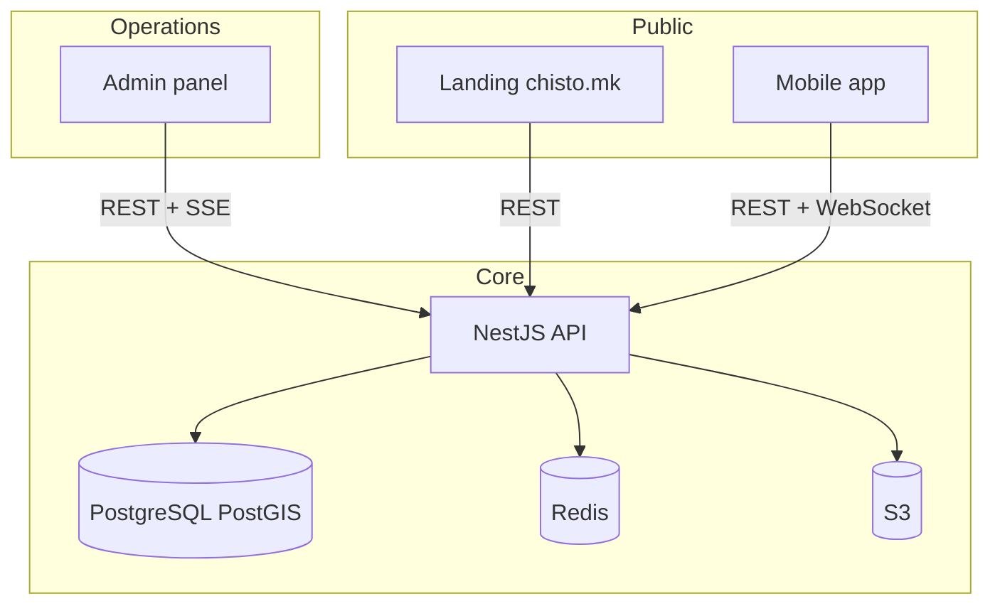

# Architecture

Chisto.mk is a pnpm monorepo: three Next.js/NestJS surfaces plus a Flutter mobile client, sharing typed contracts and news content packages.

## System overview

## Applications

### API (`apps/api`)

NestJS service. Domains include auth, pollution reports, site lifecycle, cleanup events, moderation, notifications, news, and admin control. Prisma ORM on PostgreSQL with PostGIS. OpenAPI at `/api/docs`.

Production: ECS on AWS (`api.chisto.mk`). Requires Redis when running more than one task (Socket.IO fan-out, refresh-token replay cache).

### Admin (`apps/admin`)

Next.js 15 moderation and operations dashboard. Session auth via API. Real-time report presence and event tooling. Production: `admin.chisto.mk`.

### Landing (`apps/landing`)

Next.js 15 marketing site with locales `mk`, `en`, `sq`. Serves legal pages, help centre, news, universal-link `/.well-known/*` for mobile deep links. Production: `chisto.mk`.

### Mobile (`apps/mobile`)

Flutter app (Melos workspace). Feature packages (`feature_reports`, `feature_events`, `feature_home`, etc.) over `chisto_infrastructure` and `design_system`. Offline report outbox with Workmanager background drain.

## Shared packages

| Package | Role |
|---------|------|
| `@chisto/api-client` | Generated OpenAPI types and admin/client helpers |
| `@chisto/news-content` | Shared news block rendering (admin, landing) |
| `@chisto/map-contracts` | Map API contract types |
| `@chisto/prisma-cli` | Prisma tooling wrapper |

## Data flows

1. **Report submit**: Mobile captures photo + GPS, API validates Macedonia bounds, S3 signed upload, moderation queue, public map after approval.
2. **Cleanup event**: Organizer creates event linked to site, participants RSVP/check-in, live impact metrics.
3. **News**: Admin authors content, landing SSG/ISR pages, optional revalidation webhook.

## Environments

| Branch | Typical deploy |
|--------|----------------|
| `develop` | Integration; API build on push; staging when gated |
| `main` | Production promotion |

See [platform-baseline-ci-env.md](platform-baseline-ci-env.md) and [infra/README.md](../infra/README.md).
