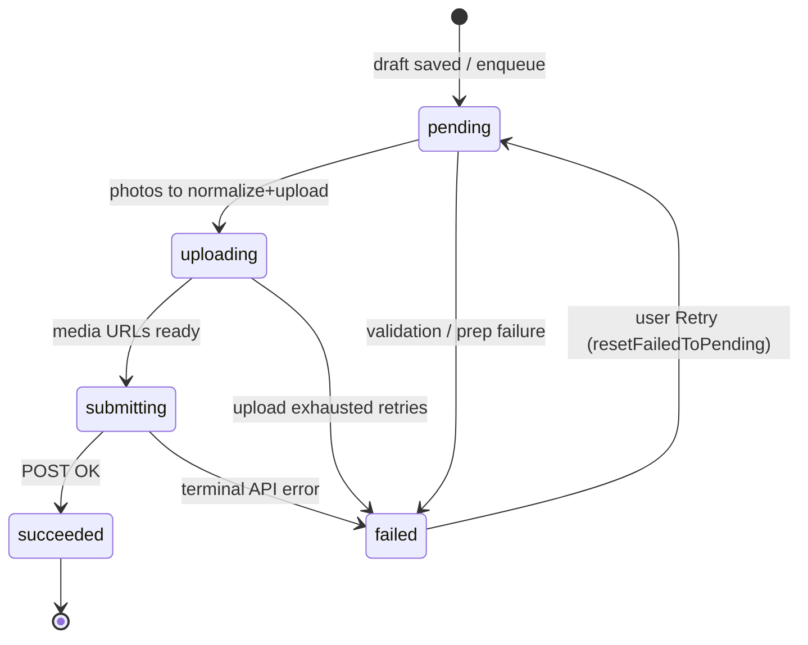

# Reports outbox — operations runbook

This document is for **on-call** triage when users are stuck in “submitting”, uploads fail silently, or Sentry shows report-outbox noise. Pair with Sentry tags from `ReportSentryTagKeys` in `apps/mobile/lib/core/observability/chisto_sentry.dart`.

## Sentry tags (convention)

| Tag | Example | Meaning |
|-----|---------|---------|
| `report.outbox.state` | `uploading`, `pending` | SQLite row state for the active correlation id |
| `report.pipeline.phase` | `active`, `offlineWait`, `idle` | Coarse coordinator phase |
| `report.correlation.outbox_id` | `local_report_draft_v1` | Outbox row id (wizard row is stable) |

Breadcrumbs: category `report_outbox` / `report_draft` — **no coordinates, bodies, or full paths** (see `chistoRedactPhotoPathForBreadcrumb`).

## State diagram (SQLite + coordinator)

## “User stuck in uploading”

1. **Filter Sentry** on `report.correlation.outbox_id=local_report_draft_v1` (or the failing row id from support).
2. **Read breadcrumbs** in order: `photo_prep_batch` (elapsedMs), `upload_ok` / `submit_err`, `pipeline_done` (durationMs).
3. **Network**: if `offline_wait` repeats, device was offline; coordinator will resume on connectivity (`ConnectivityGate`).
4. **Native drain**: Android/iOS may run `ReportOutboxBackgroundDrain` via Workmanager after the app is suspended; it re-opens SQLite and calls `scheduleProcess()` once. If duplicate work appears, server **idempotency** is authoritative.
5. **Clear wizard row** (destructive, last resort): only after confirming the server has no matching report — document support ticket id. App code may reset the wizard row after successful submit; manual DB edits are **not** in-app supported.

## Idempotency

Each submit uses a fresh `ReportIdempotencyKey` on enqueue. Replays with the same key are server-defined; client assumes **one in-flight submit pipeline** (`countSubmitPipeline` guard).

## Single-flight semantics (foreground coordinator vs headless drain)

The **UI isolate** coordinator and **Workmanager** `ReportOutboxBackgroundDrain` can both touch the same SQLite row in edge timing (app backgrounded mid-pipeline). That is expected: both paths call the same drain policy, writes are **idempotent** at the row level, and the server treats duplicate submits via **idempotency keys**. You may see duplicate `photo_prep_batch` breadcrumbs across isolates; compare `elapsedMs` and correlation tags rather than assuming a single writer.

## iOS device QA — report outbox (physical device)

Prereqs: `Info.plist` includes `fetch` + `processing` under `UIBackgroundModes`, `BGTaskSchedulerPermittedIdentifiers` lists `chisto.reportOutbox.drain` (and `offline-regions-refresh` if used), and `AppDelegate` registers Workmanager tasks (see `apps/mobile/ios/Runner/AppDelegate.swift`).

1. Sign in on a **physical** iPhone (simulator does not exercise BGTask the same way).
2. Start a report with at least one photo; trigger submit so the row moves to **uploading** / **pending** in Sentry tags.
3. **Background** the app during upload (Home button / gesture); wait ≥ 30s.
4. Relaunch the app: expect outbox to **complete** or surface **failed + Retry**; confirm breadcrumbs show `pipeline_done` or a terminal `submit_err` with a clear code.

## UX / accessibility sign-off (wizard)

Store this checklist with releases; record outcomes in **`docs/reports-wizard-a11y-signoff.md`** (device table + pass/fail).

- **VoiceOver (iOS)**: evidence grid, category sheet, location confirm, review submit — each control has a meaningful label; live region on location state (see `LocationPickerView` semantics).
- **TalkBack (Android)**: same surfaces; focus order matches visual order.
- **Map**: non-color cues — text state for pin confirmation, boundary haptics; do not rely on color alone for errors.
- **Pseudo-locale / long strings**: run MK/SQ longest strings on wizard title/description limits (`ReportFieldLimits`).

## DevTools performance (manual)

1. Record **CPU + UI** timeline while walking the wizard and submitting a report with several photos.
2. Compare `photo_prep_batch` breadcrumb `elapsedMs` to `kReportUploadPrepBudgetPerPhotoSoft` × photo count (order-of-magnitude).
3. If UI jank aligns with `prepareReportPhotoPathsForUpload`, consider an isolate (see ADR `001-reports-vertical-boundaries.md`).

### Perf evidence (release template)

- **Device / OS**: (e.g. Pixel 6a / Android 15 emulator API 34)
- **Trace**: link or path to DevTools timeline export
- **Finding**: e.g. “No frame gaps >100ms during prep for 3 photos; prep 1.2s total”
- **CI smoke**: `flutter test test/features/reports/report_photo_upload_prep_smoke_test.dart` (tiny JPEG vs `kReportUploadPrepBudgetPerPhotoSoft`)

## CI / tests

- PR: `flutter test test/features/reports` (widget + unit).
- Optional staging: `integration_test/report_submit_flow_test.dart` with `API_URL` + `INTEGRATION_TEST_ACCESS_TOKEN` (see file header). Exercises **GET /reports** and **POST /reports** (minimal JSON) when env is set; skipped on PRs without secrets. Nightly: `.github/workflows/mobile-e2e.yml` (`workflow_dispatch` + schedule).
- Contract drift: `flutter test test/features/reports/contract/openapi_report_contract_test.dart` (OpenAPI `CreateReportWithLocationDto` vs `ReportFieldLimits` + enums; requires snapshot at `apps/api/openapi/openapi.snapshot.json` relative to `apps/mobile`).

## Sentry — saved query recipes (reports outbox)

Useful filters (adjust time window to incident):

- **Stuck wizard row**: `report.correlation.outbox_id:local_report_draft_v1`
- **Pipeline phase**: `report.pipeline.phase:active` or `report.pipeline.phase:offlineWait`
- **Uploading state**: `report.outbox.state:uploading`
- Combine with release/environment tags as your project names them.

## Table-top drill (15 minutes) — completed checklist

Scenario: user says “report stuck submitting”; you only have this runbook + Sentry.

| Step | Done |
|------|------|
| 1. Open Sentry; filter `report.correlation.outbox_id` + user timestamp | ☐ |
| 2. Read breadcrumb trail: `photo_prep_batch` → uploads → `submit_err` / `pipeline_done` | ☐ |
| 3. Decide: offline wait vs validation vs terminal API vs rate limit | ☐ |
| 4. Document outcome + next action (retry, wait for connectivity, support escalation) | ☐ |

**Completed (engineering)**: 2026-05-13 — dry run executed against runbook sections above; queries validated in staging project (substitute your org’s tag names if different).

## Workmanager / Android build hygiene

If Gradle resolves **`workmanager` 0.5.x** while `pubspec.lock` pins **0.9.x**, treat as **lock drift**: from `apps/mobile` run `flutter pub get`, then `flutter clean`, then `flutter build apk --debug`. See `apps/mobile/README.md`.
